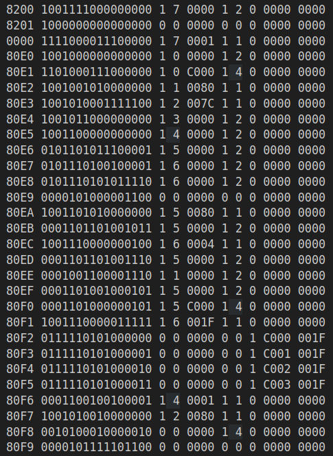

This is a simulator of the LC4 16-bit computer. The simulator executes machine code (1s and 0s) and writes it to the memory of a simulated machine.

LC4 is a simple CPU that we use at UPenn for studying computer architecture. LC4 was developed by UPenn as an improvement on top of the more standard LC3. Public versions of LC4 do not exist, which makes it hard for you to run my program. It's 3:42 am right now and I can barely keep my eyes open, but I may include some demos of my program at a later date. For now, enjoy this sample output simulating the CPU state of a program that draws a checkers board in machine code:

